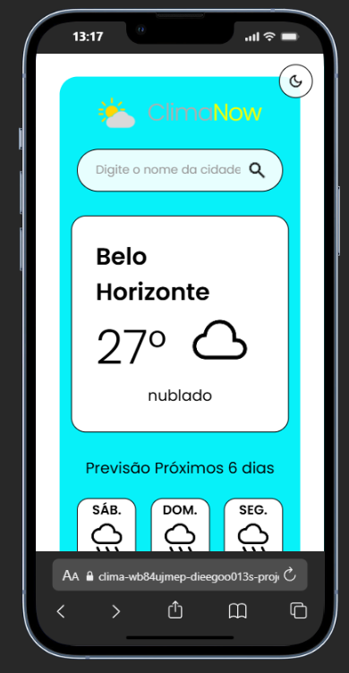

<h1 align="center" style="font-weight: bold;">ClimaNow 🌤️</h1>

<div align="center">


</div>

<p align="center">
 <a href="#sobre">Sobre</a> • 
 <a href="#funcionalidades">Funcionalidades</a> • 
 <a href="#tecnologias">Tecnologias</a> • 
 <a href="#como-rodar">Como Rodar</a> • 
 <a href="#preview">Preview</a> •
 <a href="#autor">Autor</a>
</p>

<p align="center">
    <b>O ClimaNow é uma aplicação web simples que exibe informações meteorológicas em tempo real utilizando JavaScript, HTML e CSS. O usuário pode consultar a previsão do tempo de qualquer cidade e visualizar dados como temperatura, condições climáticas e umidade.</b>
</p>

---

<h2 id="sobre">📋 Sobre o Projeto</h2>

O **ClimaNow** é um projeto desenvolvido com o objetivo de praticar o consumo de **APIs**, manipulação do DOM e integração entre **front-end e JavaScript**.  

A aplicação consome uma **API de clima** para buscar informações atualizadas e apresenta os dados de forma **clara e intuitiva**.  
O layout foi pensado para ser **leve e responsivo**, funcionando bem em celulares, tablets e desktops.

---

<h2 id="funcionalidades">🚀 Funcionalidades Principais</h2>

- 🌍 **Consulta de cidades** para obter a previsão do tempo  
- 🌡️ **Exibição de temperatura, umidade e condições climáticas**  
- 🔄 **Atualização dinâmica dos dados** sem recarregar a página  
- 🎨 **Interface responsiva e visual agradável**  
- ⚡ **Aplicação leve e rápida**, totalmente front-end  

---

<h2 id="tecnologias">💻 Tecnologias Utilizadas</h2>

<div>
  
  <span>JavaScript (ES6+)</span>
</div>
<div>
  
  <span>HTML5</span>
</div>
<div>
  
  <span>CSS3</span>
</div>

---

<h2 id="como-rodar">🚀 Como Rodar o Projeto</h2>

1️⃣ **Clone o repositório**
```bash
git clone https://github.com/Dieegoo13/ClimaNow.git
`````
<h2 id="preview">📸 Preview do Projeto</h2> 


